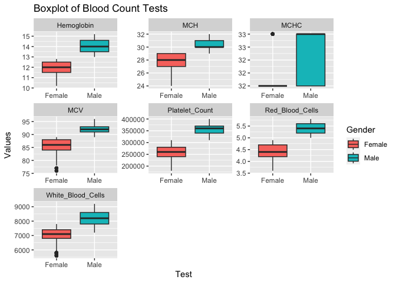
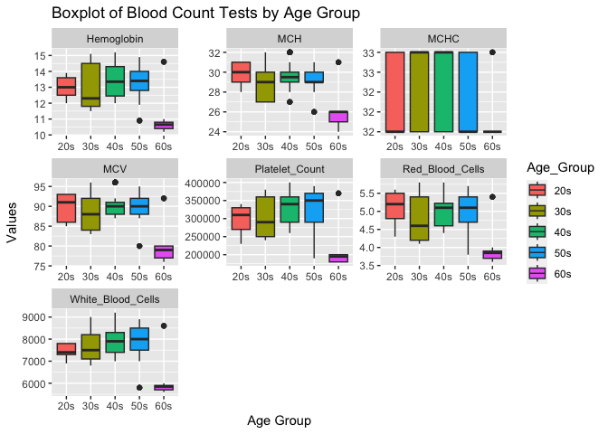

## Instructions
This homework is a bit less traditional this week. There are some errors in the code below. In addition add notes and titles to the code chunks that explains what the code chunck does. Use AI tools, notes from class, or any other resources to help fix the errors. Feel free to edit any plots to your preference. Don't forget to answer the two questions at the bottom. Upon completion, you should not have to '#' out any of the code chunks.

Push your final work to your repository. Your final lab report should be organized, clean, and run free from errors. Remember, you must remove the `#` for the included code chunks to run. Be sure to add your name to the author header above.   

Again make sure to use the formatting conventions of RMarkdown to make your report neat and clean!  


```r
library(tidyverse)
```

```
## ── Attaching core tidyverse packages ──────────────────────── tidyverse 2.0.0 ──
## ✔ dplyr     1.1.2     ✔ readr     2.1.4
## ✔ forcats   1.0.0     ✔ stringr   1.5.0
## ✔ ggplot2   3.4.2     ✔ tibble    3.2.1
## ✔ lubridate 1.9.2     ✔ tidyr     1.3.0
## ✔ purrr     1.0.1     
## ── Conflicts ────────────────────────────────────────── tidyverse_conflicts() ──
## ✖ dplyr::filter() masks stats::filter()
## ✖ dplyr::lag()    masks stats::lag()
## ℹ Use the conflicted package (<http://conflicted.r-lib.org/>) to force all conflicts to become errors
```

```r
library(janitor)
```

```
## 
## Attaching package: 'janitor'
## 
## The following objects are masked from 'package:stats':
## 
##     chisq.test, fisher.test
```

```r
library(dplyr)
```


1. Reads in the data

```r
blood_count <- read_csv("data/blood_count_dataset.csv")
```

```
## Rows: 417 Columns: 9
## ── Column specification ────────────────────────────────────────────────────────
## Delimiter: ","
## chr (1): Gender
## dbl (8): Age, Hemoglobin, Platelet_Count, White_Blood_Cells, Red_Blood_Cells...
## 
## ℹ Use `spec()` to retrieve the full column specification for this data.
## ℹ Specify the column types or set `show_col_types = FALSE` to quiet this message.
```

2. Gives an idea of what the dataset 'blood_count' looks like, has a typo

```r
glimpse(blood_count)
```

```
## Rows: 417
## Columns: 9
## $ Age               <dbl> 68, 25, 57, 28, 38, 47, 37, 30, 35, 22, 41, 34, 40, …
## $ Gender            <chr> "Female", "Male", "Male", "Female", "Male", "Female"…
## $ Hemoglobin        <dbl> 10.4, 13.8, 13.5, 12.7, 14.9, 12.0, 14.5, 11.8, 11.5…
## $ Platelet_Count    <dbl> 180000, 320000, 370000, 290000, 380000, 260000, 3800…
## $ White_Blood_Cells <dbl> 5700, 7500, 8500, 7800, 8700, 7000, 8700, 7000, 7100…
## $ Red_Blood_Cells   <dbl> 3.7, 5.4, 5.1, 4.8, 5.7, 4.4, 5.7, 4.2, 4.2, 5.6, 4.…
## $ MCV               <dbl> 77, 92, 90, 86, 95, 87, 95, 84, 84, 93, 88, 85, 96, …
## $ MCH               <dbl> 25, 30, 29, 29, 31, 28, 31, 27, 27, 31, 29, 28, 32, …
## $ MCHC              <dbl> 32, 32, 32, 33, 33, 32, 33, 32, 32, 32, 33, 32, 33, …
```

3. Provides min, mean, and max for 'blood_count', typo in second mean and missing a paranthesis/comma and variable must be red blood cells

```r
blood_count %>% 
  group_by(Red_Blood_Cells) %>% 
  summarize(min=min(Red_Blood_Cells),
            mean=mean(Red_Blood_Cells),
            max=max(Red_Blood_Cells))
```

```
## # A tibble: 23 × 4
##    Red_Blood_Cells   min  mean   max
##              <dbl> <dbl> <dbl> <dbl>
##  1             3.6   3.6   3.6   3.6
##  2             3.7   3.7   3.7   3.7
##  3             3.8   3.8   3.8   3.8
##  4             3.9   3.9   3.9   3.9
##  5             4     4     4     4  
##  6             4.1   4.1   4.1   4.1
##  7             4.2   4.2   4.2   4.2
##  8             4.3   4.3   4.3   4.3
##  9             4.4   4.4   4.4   4.4
## 10             4.5   4.5   4.5   4.5
## # ℹ 13 more rows
```


4. Mean values for columns 3-9 for males

```r
options(scipen = 999, digits = 2)

blood_count %>% 
  filter(Gender == "male") %>% #filters for males
  select(3:9) %>% #selects column 3-9
  colMeans(na.rm = TRUE) #gives the column means
```

```
##        Hemoglobin    Platelet_Count White_Blood_Cells   Red_Blood_Cells 
##               NaN               NaN               NaN               NaN 
##               MCV               MCH              MCHC 
##               NaN               NaN               NaN
```

5. Finds the mean values for females of columns 3-9

```r
blood_count %>% 
  filter(Gender == "Female") %>% #filters for females
  select(3:9) %>% #selects for columns 3-9
  summarise_all(mean, na.rm = T) #calculates the mean
```

```
## # A tibble: 1 × 7
##   Hemoglobin Platelet_Count White_Blood_Cells Red_Blood_Cells   MCV   MCH  MCHC
##        <dbl>          <dbl>             <dbl>           <dbl> <dbl> <dbl> <dbl>
## 1       11.9        255913.             6968.            4.36  84.9  27.7  32.2
```


6. Create boxplots showing blood count values across different tests, each boxplot representing a different test, boxplots grouiped by gender, each test = own facet

```r
blood_count %>%
  pivot_longer(cols = 3:9, names_to = "Test", values_to = "Values") %>% #changed to pivot_longer
  ggplot(aes(x = Gender, y = Values, fill = Gender))+
  geom_boxplot()+
  facet_wrap(~ Test, scales = "free")+ 
  labs(title = "Boxplot of Blood Count Tests",
       x = "Test",
       y = "Values")
```

<!-- -->

7. Create new column Age_Group sorted into ten year intervals

```r
grouped_bc <- blood_count %>%
  mutate(Age_Group = case_when( #replaced with mutate
    Age >= 20 & Age <= 29 ~ "20s",
    Age >= 30 & Age <= 39 ~ "30s",
    Age >= 40 & Age <= 49 ~ "40s",
    Age >= 50 & Age <= 59 ~ "50s",
    Age >= 60 & Age <= 70 ~ "60s")) # there were only 4 people in 70s, so I combined it with 60s

head(grouped_bc)
```

```
## # A tibble: 6 × 10
##     Age Gender Hemoglobin Platelet_Count White_Blood_Cells Red_Blood_Cells   MCV
##   <dbl> <chr>       <dbl>          <dbl>             <dbl>           <dbl> <dbl>
## 1    68 Female       10.4         180000              5700             3.7    77
## 2    25 Male         13.8         320000              7500             5.4    92
## 3    57 Male         13.5         370000              8500             5.1    90
## 4    28 Female       12.7         290000              7800             4.8    86
## 5    38 Male         14.9         380000              8700             5.7    95
## 6    47 Female       12           260000              7000             4.4    87
## # ℹ 3 more variables: MCH <dbl>, MCHC <dbl>, Age_Group <chr>
```

8. Creates a boxplot of blood count tests by age group

```r
grouped_bc %>%
  pivot_longer(cols = 3:9, names_to = "Test", values_to = "Values") %>%
  ggplot(aes(x = Age_Group, y = Values, fill = Age_Group)) + #typo
  geom_boxplot() +
  facet_wrap(~Test, scales = "free") +  # Facet by the "Test" variable
  labs(title = "Boxplot of Blood Count Tests by Age Group",
       x = "Age Group",
       y = "Values")
```

<!-- -->
9. What are two drawbacks and two benefits of AI?
Two drawbacks- once it gets stuck on something being an error or a strategy to fix an error it can be hard to get it to redirect, I got it stuck on question 8 and it was unable to answer or move on

Two benefits- it finds oversight mistakes like typos or missing paranthesis very fast, it can be a very good way to get started troubleshooting

10. Do you think you will use AI for coding in the future? Why or why not?
Yes! It was a great way to at least get started on a problem and fixed some of the error instantly.

## Push your final code to GitHub!
Please be sure that you check the `keep md` file in the knit preferences. 
